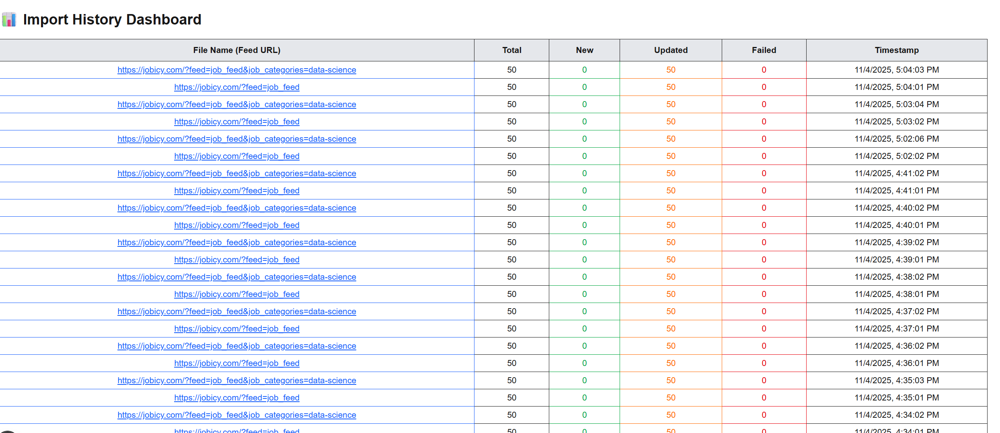

# 🚀 MERN Job Importer & Cron Automation System

A full-stack MERN application that automatically **fetches job listings from multiple RSS feeds**, **queues them in Redis**, and **processes them asynchronously** using BullMQ workers.
Each import cycle is logged in MongoDB and displayed on a **React dashboard** with auto-refresh.

---

## 🧩 Features

✅ Automated job import every minute using **Node Cron**
✅ Background job processing via **BullMQ + Redis**
✅ Feed parsing from **XML (RSS)** to JSON
✅ MongoDB tracking for every import (logs, new jobs, updates, failures)
✅ Express REST API for Import Logs
✅ React frontend to display Import History (auto-refresh every minute)

---

## 🧱 Tech Stack

| Layer      | Technology          |
| ---------- | ------------------- |
| Frontend   | Next.js (Vite/CRA)  |
| Backend    | Node.js, Express.js |
| Database   | MongoDB + Mongoose  |
| Queue      | Redis + BullMQ      |
| Scheduler  | Node-Cron           |
| XML Parser | xml2js              |

---

## ⚙️ Project Architecture

```
[ CRON JOB ]
     │
     ▼
[ FETCH RSS FEEDS ] ───▶ [ ADD JOBS TO QUEUE (Redis) ]
                                 │
                                 ▼
                           [ WORKER PROCESS ]
                                 │
                                 ▼
                         [ MongoDB Database ]
                                 │
                                 ▼
                       [ ImportLog + Job Models ]
                                 │
                                 ▼
                       [ React Frontend (Dashboard) ]
```

---

## 📂 Folder Structure

```
src/
 ├── config/
 │    └── db.js               # MongoDB connection
 ├── jobs/
 │    ├── queue.js            # Redis queue setup
 │    ├── cron.js             # Scheduler for fetching feeds
 │    └── worker.js           # Worker to process queue jobs
 ├── models/
 │    ├── Job.js              # Job model
 │    └── ImportLog.js        # Import history model
 ├── routes/
 │    └── importLogRoutes.js  # API for frontend logs
 ├── services/
 │    └── jobService.js       # Fetch + parse XML feeds
 └── server.js                # Express app entry point
```

---

## 🛠️ Installation & Setup

### 1. Clone the repository

```bash
git clone https://github.com/yourusername/job-importer.git
cd job-importer
```

### 2. Install dependencies

```bash
npm install
```

### 3. Setup environment variables

Create a `.env` file in the project root:

```
MONGO_URI=mongodb://127.0.0.1:27017/jobportal
REDIS_HOST=127.0.0.1
REDIS_PORT=6379
QUEUE_NAME=job-import-queue
JOB_SOURCES=https://jobicy.com/?feed=job_feed,https://jobicy.com/?feed=job_feed&job_categories=data-science
PORT=5000
```

###

🐳 1. Run Redis with Docker

Start Redis container:

docker run -d \
 --name redis-server \
 -p 6379:6379 \
 redis:latest

Confirm it’s running:

docker ps

Connect to Redis CLI (optional):

docker exec -it redis-server redis-cli
127.0.0.1:6379> PING
PONG

### 5. Run all processes (in separate terminals)

```bash
# Terminal 1 - Start Express API
npm run server

# Terminal 2 - Start Cron (fetch feeds every 1 minute)
npm run cron

# Terminal 3 - Start Worker (process queue jobs)
npm run worker

                    ##OR

# Run All Together -Start Express API, Worker, Cron
npm run dev
```

---

## 🧠 How It Works

1. **Cron job** runs every minute → fetches job feeds via `axios` + `xml2js`.
2. Creates a **new ImportLog** document with `totalFetched` count.
3. Adds all jobs to the **Redis queue**.
4. The **Worker** consumes jobs, creates/updates records in MongoDB, and updates ImportLog stats:

   - `newJobs` → if new
   - `updatedJobs` → if existing
   - `failedJobs` → if any errors

5. The **Frontend Dashboard** fetches `/api/import-logs` every minute to display logs.

---

## 🧾 Example Log Document (MongoDB)

```json
{
  "_id": "690986ae80df41ffb9545f9f",
  "source": "https://jobicy.com/?feed=job_feed&job_categories=data-science",
  "timestamp": "2025-11-04T04:53:02.733Z",
  "totalFetched": 50,
  "totalImported": 50,
  "newJobs": 0,
  "updatedJobs": 50,
  "failedJobs": []
}
```

---

## 🌐 API Endpoints

| Method | Endpoint           | Description                                 |
| ------ | ------------------ | ------------------------------------------- |
| GET    | `/api/import-logs` | Fetch all import logs (sorted by timestamp) |

---

## 🖥️ Frontend (Auto-refresh Dashboard)

- Displays recent import logs.
- Fetches data every **60 seconds** using `setInterval`.
- Uses TailwindCSS or your choice of styling.

Example (React):

```js
useEffect(() => {
  fetchLogs();
  const interval = setInterval(fetchLogs, 60000);
  return () => clearInterval(interval);
}, []);
```

---

## 🧰 Scripts (in package.json)

```json
"scripts": {
  "server": "node src/server.js",
  "cron": "node src/jobs/cron.js",
  "worker": "node src/jobs/worker.js",
  "dev": "concurrently \"npm run start:server\" \"npm run start:worker\""
}
```

---

## 📊 Import History Dashboard Preview



## 👨‍💻 Author

**Sunny Yadav**
Full Stack Developer | MERN

---

## 🏁 License

MIT License © 2025
